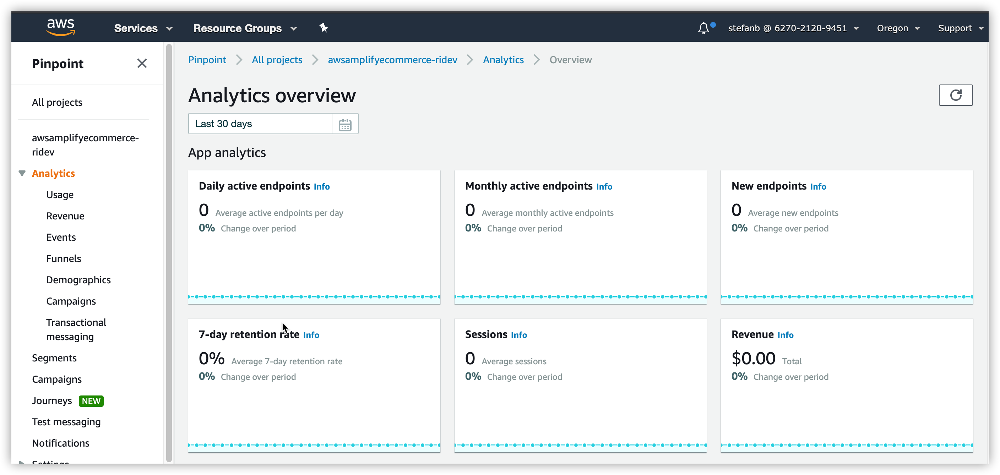
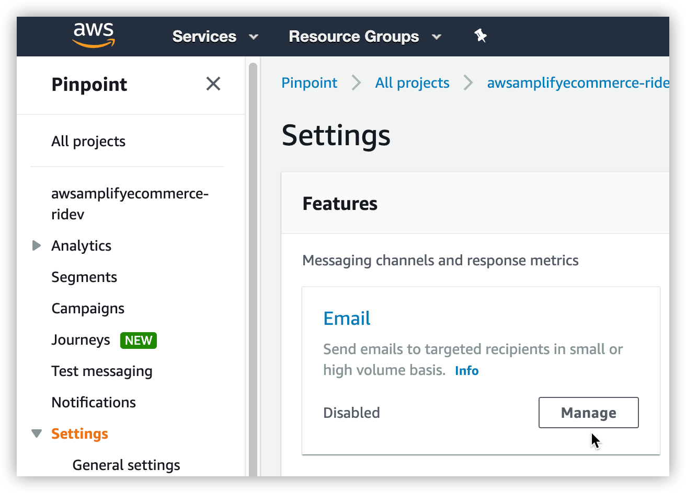
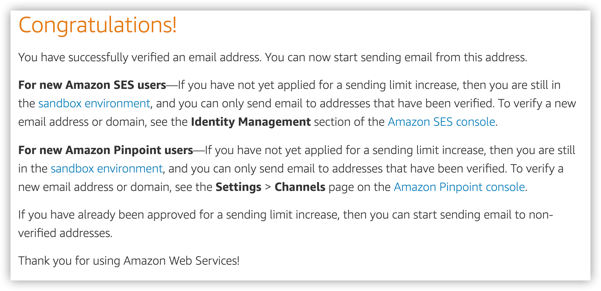
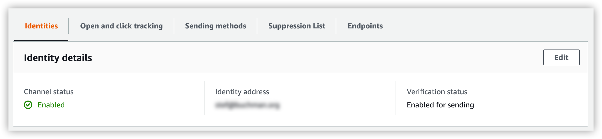

# Project and Backend Setup <!-- omit in toc -->

We'll now setup the backend environment for our application as well as establish our initial Pinpoint configuration.

## Table of Contents
- [Create Project](#create-project)
  - [Initialize the project](#initialize-the-project)
- [Backend Setup](#backend-setup)
  - [Inspect Configuration](#inspect-configuration)
  - [Create resources in AWS](#create-resources-in-aws)
  - [Pinpoint Initial Setup](#pinpoint-initial-setup)

# Create Project

## Initialize the project

We're now going to clone our e-commerce store and the backend environment to support it.

Simply `git clone` the repo `https://github.com/StefanBuchman/aws-amplify-ecommerce` into another folder using the following commands:

```Shell
git clone https://github.com/StefanBuchman/aws-amplify-ecommerce
cd aws-amplify-ecommerce
```

Run this command inside the project folder to initialise your environment.

**IMPORTANT**: Ensure you are in the **`aws-amplify-ecommerce`** directory.

```Shell
amplify init
```

Follow the commands in the follwing code block, taking note of the answers.

**NOTE**: Use your arrow keys to select from a list of options, followed by the enter key

```
? Do you want to use an existing environment? No
? Enter a name for the environment reinvent
? Choose your default editor: None
Using default provider  awscloudformation
AWS access credentials can not be found.
? Setup new user Yes
Follow these steps to set up access to your AWS account:

Sign in to your AWS administrator account:
https://console.aws.amazon.com/
Press Enter to continue

Specify the AWS Region
? region:  us-west-2
Specify the username of the new IAM user:
? user name:  amplify-XXXX
Complete the user creation using the AWS console
https://console.aws.amazon.com/iam/home?region=undefined#/users$new?step=final&accessKey&userNames=amplify-6AJCR&permissionType=policies&policies=arn:aws:iam::aws:policy%2FAdministratorAccess
Press Enter to continue

Enter the access key of the newly created user:
? accessKeyId:  **********************
? secretAccessKey:  ************************************
This would update/create the AWS Profile in your local machine
? Profile Name:  default

Successfully set up the new user.

For more information on AWS Profiles, see:
https://docs.aws.amazon.com/cli/latest/userguide/cli-multiple-profiles.html

? Do you want to use an AWS profile? Yes
? Please choose the profile you want to use default
Adding backend environment reinvent to AWS Amplify Console app: d1d99z1dndh7mk
⠏ Initializing project in the cloud...
```

From here Amplify will initialize your project in the cloud.  When complete you should see the following question:

```
✔ Successfully created initial AWS cloud resources for deployments.
✔ Initialized provider successfully.
? Do you want to configure Lambda Triggers for Cognito? No
Initialized your environment successfully.

Your project has been successfully initialized and connected to the cloud!
```

# Backend Setup

We should now have an initialized project in the cloud.

Run **`amplify status`** to get a list of resources that Amplify has detected in the project.  You should see a table like the one below:

| Category  | Resource name           | Operation | Provider plugin   |
| --------- | ----------------------- | --------- | ----------------- |
| Auth      | awsamplifyecommerceauth | Create    | awscloudformation |
| Analytics | awsamplifyecommerce     | Create    | awscloudformation |
| Storage   | dynamodbitems           | Create    | awscloudformation |
| Function  | lambdaitems             | Create    | awscloudformation |
| Api       | awsamplifyecommerceapi  | Create    | awscloudformation |

The table above indicates that 5 backend features have been detected in the project.  As these features have not been deployed to the cloud yet they have *Create* listed as the next operation.

## Inspect Configuration

We can view the configuration and CloudFormation created for each of these services by exploring the `/amplify/backend` directory.

Go ahead and explore the services to be provisioned.  You should see:

1. A parameter file with specific settings for the service to be provisioned
   
2. A CloudFormation template for creating the resouce in the cloud

## Create resources in AWS

Let's go ahead and create our resources in AWS now.  To do so we will push our config up to the cloud which will launch our CloudFormation and provision our defined resources in the cloud.

Type in the follwing in your Cloud9 terminal to kick off the provisioning:
```
amplify push
```

You should see your resouces being provisioned now, this should take a couple minutes to complete.

Run another **`amplify status`** and you should now see the following

```
| Category  | Resource name           | Operation | Provider plugin   |
| --------- | ----------------------- | --------- | ----------------- |
| Auth      | awsamplifyecommerceauth | No Change | awscloudformation |
| Analytics | awsamplifyecommerce     | No Change | awscloudformation |
| Storage   | dynamodbitems           | No Change | awscloudformation |
| Function  | lambdaitems             | No Change | awscloudformation |
| Api       | awsamplifyecommerceapi  | No Change | awscloudformation |

Pinpoint URL to track events https://us-west-2.console.aws.amazon.com/pinpoint/home/?region=us-west-2#/apps/*****************/analytics/overview
```

An operation of *No Change* means that all our resources have been provisioned in our AWS account.

Go ahead and take a look at the new services that have been created:

- [Amazon Cognito](https://us-west-2.console.aws.amazon.com/cognito/users/?region=us-west-2)
- [Amazon DynamoDB](https://us-west-2.console.aws.amazon.com/dynamodb/home?region=us-west-2)
- [AWS Lambda](https://us-west-2.console.aws.amazon.com/lambda/home?region=us-west-2)
- [Amazon API Gateway](https://us-west-2.console.aws.amazon.com/apigateway/home?region=us-west-2)

## Pinpoint Initial Setup

Once everything has been successfully provisioned you should have a URL for the new Pinpoint endpoint we'll be using.

Copy the URL for Pinpoint and open it in a new browser window.

You should see the default layouy with no data



Let's go ahead and setup the e-mail configuration and verify your email address for use with Pinpoint.

1. Navigate to **Settings** and click on **Manage**
   

2. Under **Identity details** click **Edit**

3. Enable the email channel and type in the email address you have access to.

>**NOTE**: We'll be using this email address for Pinpoint as well as for your registration for the Store.  Make sure you select one you're able to check for mail on.

4. Click on **Verify email address**

5. Finally, click on the **Save** button

5. You should receive an e-mail with a link to verify your email address, go ahead and check your email and follow the link to verify your email address.



6. Refesh your Pinpoint screen and you should see the following, confirming you are able to send email using your email address



You've now completed the backend setup, head to [Hosting for E-commerce Store](/documentation/hosting/) to setup hosting for the frontend.
