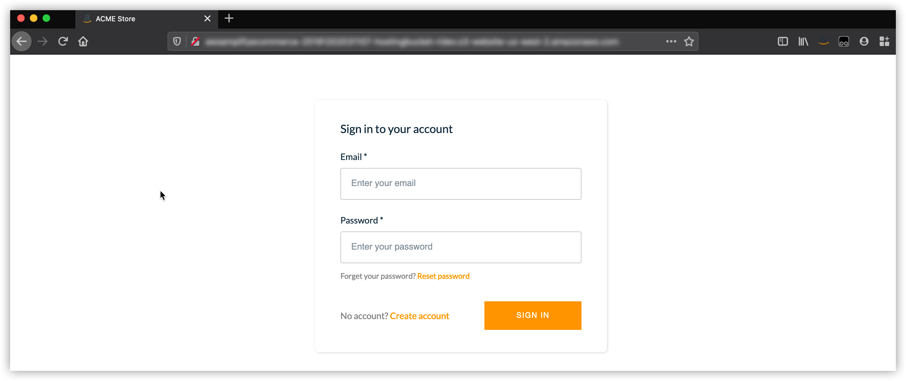
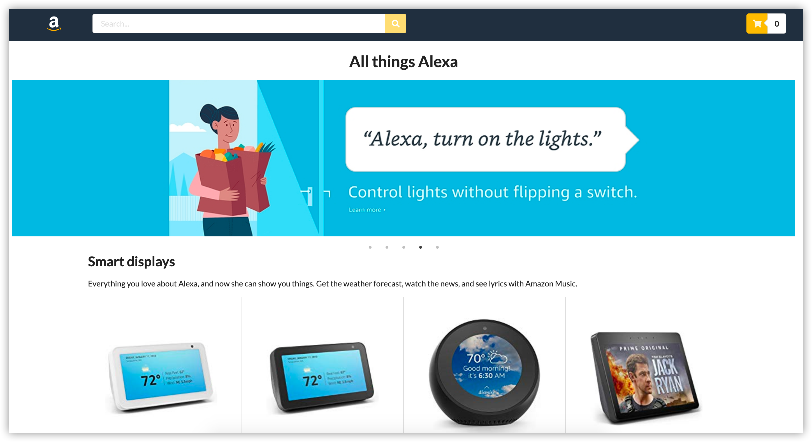

# Host the E-commerce Store <!-- omit in toc -->

These steps will guide you through the process of hosting the e-commerce frontend application for our store.

We'll be using Amplify to add hosting to our application and then deploy the application to an S3 bucket.

Amplify supports two configurations for hosting your web application.  The first, for development environments is to host the application in an S3 bucket.  The second, geared towards production environments is to host in an S3 bucket but fronted by a [Amazon CloudFront](https://aws.amazon.com/cloudfront/) distribution.

The CloudFront deployment model provides your website with a Content Delivery Network (CDN), making sure your web application is located closely to your customers.  CloudFront also adds the ability to use a Web Applicaiton Firewall (WAF) to protect and inspect traffic to your website, as well as add geo-fencing to your web applicaitons.

## Table of Contents
- [Add Hosting](#add-hosting)
  - [Create Hosting Configuration](#create-hosting-configuration)
  - [Deploy Website](#deploy-website)
- [Launch!](#launch)

# Add Hosting

For this workshop we'll be using the S3 deployment model.  Using this mode, we'll add a new feature to our application, configure it and finally deploy our configuration to our AWS environment.

## Create Hosting Configuration

1. First, head back to our Cloud9 environment and go back to the terminal you've been typing commands into.

2. Add a feature to our Amplify configuration by typing:

```
amplify add hosting
```

3. Press **Enter** to confirm you'll be using `DEV (S3 only with HTTP)` as your hosting configuration

4. Choose an S3 bucket name to host your web application in.  Press **Enter** to select the default (unique) name or type a new one to select a different name.

5. Press **Enter** to confirm the default index document

6. Press **Enter** to confirm the default error document

7. Run **`amplify status`** to list your configuration.  You should now see your new hosting configuration as being ready to create in AWS

```
| Category  | Resource name           | Operation | Provider plugin   |
| --------- | ----------------------- | --------- | ----------------- |
| Hosting   | S3AndCloudFront         | Create    | awscloudformation |
| Auth      | awsamplifyecommerceauth | No Change | awscloudformation |
| Analytics | awsamplifyecommerce     | No Change | awscloudformation |
| Storage   | dynamodbitems           | No Change | awscloudformation |
| Function  | lambdaitems             | No Change | awscloudformation |
| Api       | awsamplifyecommerceapi  | No Change | awscloudformation |
```

## Deploy Website

We'll now create our hosting bucket and build and deploy our web application to our S3 bucket.

1. Go ahead and push our configuration to AWS to have our S3 bucket created, press **Enter** when you're asked to confirm

```
amplify push
```

When this command completes you'll get a new endpoint URL with your new S3 bucket as a target.

>**NOTE**: If you try follow this link now you'll get an 'Access Denied' error message.  While the bucket exists we haven't uploaded our website yet.

We can now deploy our web application to AWS. However, before we deploy our application to the cloud we need to install the applications dependencies.

2. To install our dependencies type:

```
npm install
```

>**NOTE**: Ignore any warnings that come up as these are general warnings for the React package and not specific to what we're doing now.

3. Deploy the application type the following from the erminal:

```
amplify publish
```

It should take a minute to build and deploy.

# Launch!

Congratulations!

We should now have a working application.  Let's head to the URL provided.  You should see the following if everything was successful:



As this is pointing to your own, previosuly configured Cognito instance, there won't be any default accounts.

1. Let's go ahead and register by clicking on **Create account**

2. Create a new account using the same e-mail address you verified previsouly in Pinpoint.  Choose a new password and enter the rest of the information.

Cognito is configured to validate our account using a verification code.

3. Head to your email and find the verification code.  Type in in the dialog to activate your account.

4. Finally, authenticate with your email address and password.  You should now see your new Store.

