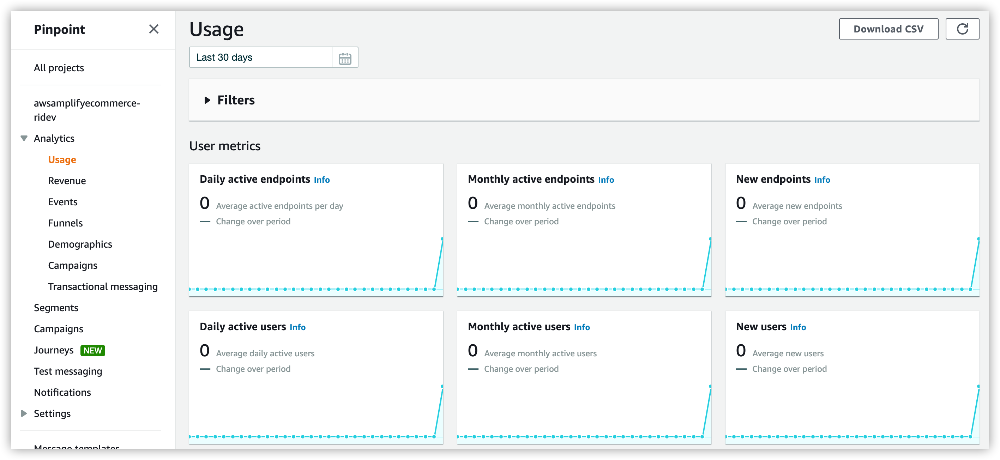
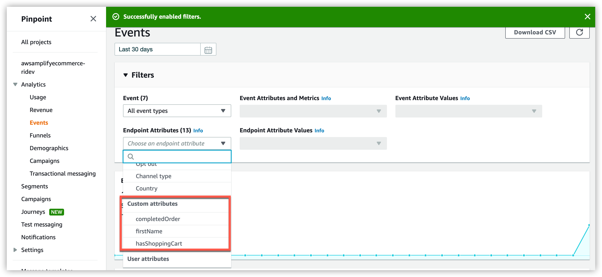
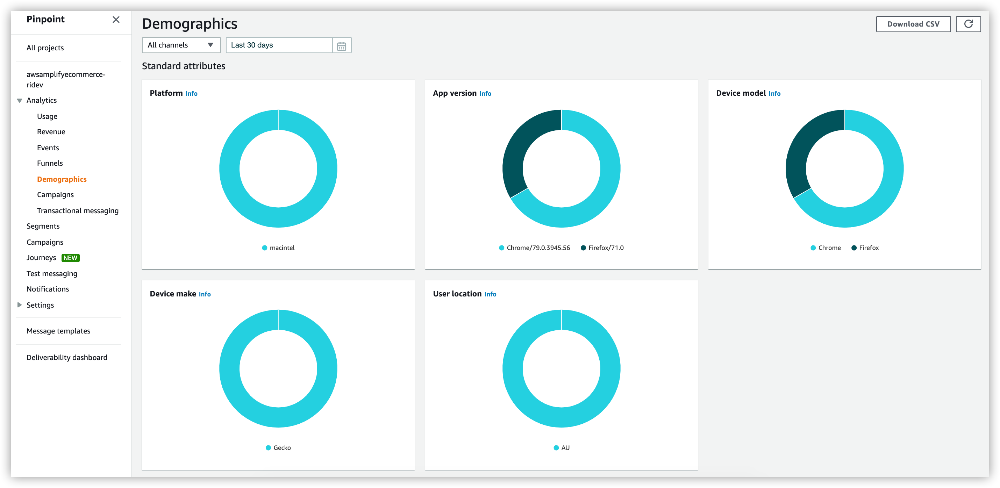
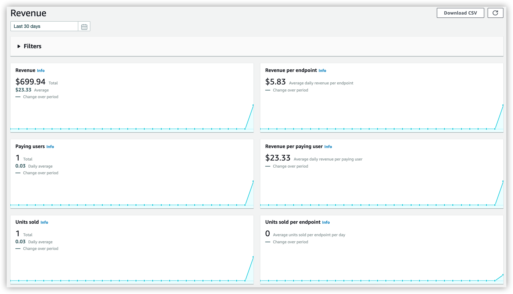
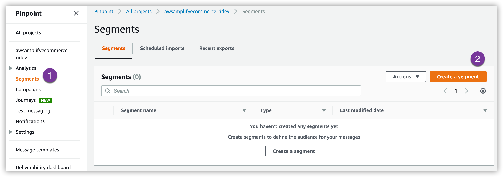
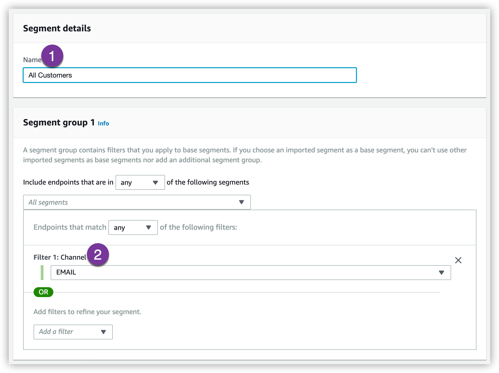
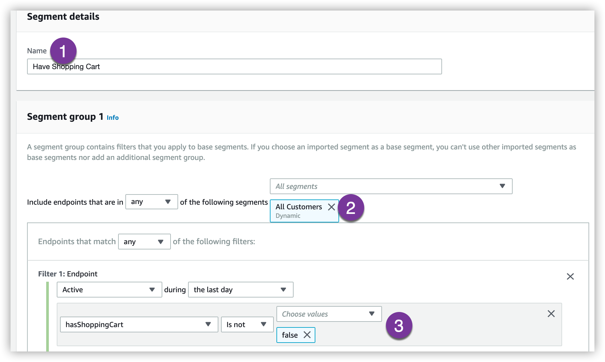

# Pinpoint Personalization <!-- omit in toc -->

At this point you have deployed your backend services and have the following capabilities deployed to your AWS account using Amplify:

- Cognito (Authentication)
- DynamoDB (NoSQL Database)
- Lambda (Serverless functions)
- API Gateway (Secure access to functions)
- Pinpoint (Analytics and Campaign management)
- S3 (Web Application Hosting)

We're now going to configure Pinpoint to personalize our customers experience as they use the web application.  For this workshop we'll focus on building personalization of the following activities:

| Customer Activity | Personalization                          |
| ----------------- | ---------------------------------------- |
| Store sign-up     | Welcome email to customer                |
| Abandoned cart    | Reminder to customer that cart has items |
| Ordered placed    | Thank customer for placing an order      |

## Table of Contents
- [Pinpoint Integration](#pinpoint-integration)
- [Explore Events](#explore-events)
- [Personalized Campaigns](#personalized-campaigns)
  - [New Customer Signup](#new-customer-signup)
    - [Create Dynamic Segment](#create-dynamic-segment)
    - [Create the Campaign](#create-the-campaign)
  - [Cart Abandoned](#cart-abandoned)
  - [Order Placed Campaign](#order-placed-campaign)

# Pinpoint Integration

Our frontend web application has been integrated with through the use of the Amplify framework.  Using Amplify, we're able to make a few simple calls to Pinpoint to start instrumenting our application.

Taking a look at our web application there are a couple areas that Amplify has been integrated.

As we've built out our backend suite of services, Amplify has been adding the configuration of those services to a file that our frontend uses.  Explore the **`/src/aws-exports.js`** file and see if you can spot the Pinpoint configuration.

If you spotted the configuration options for **`aws_mobile_analytics_*`** then you saw two lines that Amplify adds for us.  In addition to that configuration, Amplify ties the role we're granted when we authenticate with Cognito to Amplify, so that only authenticated customers can generate specific events.

Pinpoint and Amplify allow us to automatically track our activity in our web application.  Our **`/src/index.js`** file contains the initial configuration for Pinpoint, reding in our configuration file and setting up autotracking in Pinpoint:

```javascript
import awsconfig from './aws-exports'
Amplify.configure(awsconfig)

Analytics.record('Store_Load');
        
Analytics.autoTrack('pageView', {
    enable: true,
    type: 'SPA'
})
```

We populate demographics and login information for our customers in a function that loads when we authenticate.  The **`/src/pages/InitState.js`** file contains the logic that logs our location as well as other initial customer attributes:

```javascript
Analytics.updateEndpoint({
    ChannelType: 'EMAIL',
    Address: data.attributes.email,
    location: {
        city: data.attributes['custom:city'],
        country: countryCode,
        postalCode: data.attributes['custom:postcode'],
        region: data.attributes['custom:state']
    },
    optOut: 'NONE',
    attributes: {
        firstName: [data.attributes.given_name],
        hasShoppingCart: ['false'],
        completedOrder: ['false']
    },
    metrics: {
        itemsInCart: 0,
        orderNumber: "0"
    }
})
```

We capture custom events as our customers interact with different parts of our application.  When a customer adds an item to the shopping cart  (**`/src/pages/Product.js`**) we capture that event as well as how many items are in the shopping cart and send those attributes and metrics to Pinpoint:

```javascript
function addItem(product, quantity) {
    addItemToCart(product, quantity)

    Analytics.updateEndpoint({
        attributes: {
            hasShoppingCart: ['true']
        },
        metrics: {
            itemsInCart: cart.items.length
        }
    })
}
```

Finally, we can also use Pinpoint to track the revenue our website is generating from sales.  When a customer places an order in **`/src/pages/Checkout.js`** we capture the sale and update the revenue generation from that endpoint:

```javascript
useEffect(() => {
    if (orderComplete) {
        Analytics.updateEndpoint({
            attributes: {
                hasShoppingCart: ['false'],
                completedOrder: ['true']
            },
            metrics: {
                itemsInCart: 0,
                orderNumber: "1001"
            }
        })

        var _mTotal = parseFloat(totalPurchase).toFixed(2)
        Analytics.record('_monetization.purchase', {
            _currency: 'USD',
            _product_id: 'XYZ',
            }, {
            _item_price: _mTotal,
            _quantity: 1.0,
            })
    }
});
```

# Explore Events

Go ahead and walk through the store, add items to your shoping list and complete the checkout process.  Come back here when you're done and we'll explore where those events landed.

Let's go ahead and enable events in Pinpoint and look at the event traffic that is being generated.

1. Within Pinpoint, click on the **Analytics -> Usage** screen and you should see events starting to flow into Pinpoint:



2. Now, click on **Events** and then **Filters** and **More information** and click on **Enable filters** to see the filter details in Pinpoint.  You should be able to see custom events from our application that you can now filter on.



3. Head to the **Demographics** section and observe the data that is now being collected by Pinpoint and aggregated across the Store's customers.



4. Finally, head to the **Revenue** section and observe how orders placed are now generating revenue metrics both for individual endpoints as well as for cohorts that can be filtered against



# Personalized Campaigns

Pinpoint has sophisticated controls for managing enagagement with our customers.  We are able to base our campaigns on specific cohorts or filter our messaging down to single-customer events we would like to personalize engagement on.

With data now flowing into our Pinpoint environment, lets go ahead and create a few personalized compaigns to engage our customers.

In order to engage our customers we need to define segments and then create campaigns that target those segments. Segments can be customer lists that you import into Pinpoint or can be generated off of dynamic data that flows into the platform.

## New Customer Signup

Let's create a new campaign to welcome a customer to our service.  We'll add some personalization to welcome our customer by name.

### Create Dynamic Segment

First we need to create a dynamic segment for our customers that have signed-up.

1. Head over to **Segments** and click on **Create segment**



2. Give you segment a name: **`All Customers`**

3. Add a filter based on Channel: **`Email`**



4. Click on **Create segment**

You should now have a segment that includes all your customers endpoints that have an e-mail address assigned.

### Create the Campaign

1. Head over to the **Campaign** section

2. Click on **New campaign** to create a new campaign

3. Give it a unique name: **`New Customers`**

4. Select the **Email** channel and click **Next**

5. From the Segments dropdown, select the segment you just created


6. We're now creating the e-mail message.  Give the e-mail a good subject: **`Welcome to the ACME Store`**

7.  Copy the follwing and replace the body of the message and click **Next**

```HTML
<!DOCTYPE html>
<html lang="en">
<head>
    <meta http-equiv="Content-Type" content="text/html; charset=utf-8">
</head>
<body>
    <div style="text-align: center;"><b>
            <font face="Verdana" size="5">Welcome to the ACME Store</font>
        </b></div>
    <div style="text-align: left;"><b>
            <font face="Verdana" size="5"><br></font>
        </b></div>
    <div style="text-align: left;">
        <font color="#444444" face="Verdana" size="2">Hi&nbsp;{{Attributes.firstName}}</font><span style="background-color: rgb(255, 255, 255); color: rgb(68, 68, 68); font-family: Verdana; font-size: small;">,</span>
    </div>
    <div style="text-align: left;">
        <font color="#444444" face="Verdana" size="2"><span style="background-color: rgb(255, 255, 255);"><br></span></font>
    </div>
    <div style="text-align: left;">
        <font color="#444444" face="Verdana" size="2"><span style="background-color: rgb(255, 255, 255);">Thank you for joining the ACME Store.&nbsp; We hope you have a great experience.</span></font>
    </div>
    <div style="text-align: left;">
        <font color="#444444" face="Verdana" size="2"><span style="background-color: rgb(255, 255, 255);"><br></span></font>
    </div>
    <div style="text-align: left;">
        <font color="#444444" face="Verdana" size="2"><span style="background-color: rgb(255, 255, 255);">Please reach out to customer care if you have any questions.</span></font>
    </div>
    <div style="text-align: left;">
        <font color="#444444" face="Verdana" size="2"><span style="background-color: rgb(255, 255, 255);"><br></span></font>
    </div>
    <div style="text-align: left;">
        <font color="#444444" face="Verdana" size="2"><span style="background-color: rgb(255, 255, 255);">ACME Store</span></font>
    </div>
    <div style="text-align: left;">
        <font color="#444444" face="Verdana" size="2"><span style="background-color: rgb(255, 255, 255);">Customer Care Department</span></font>
    </div>
</body>
</html>
```

8. For our event timing, we want to send this event when a user signs-up.  To do that select **When an event occurs** and select **`_userauth.sign_up`** as the event.

9. Finally, select when this camnpaign will start, which needs to be 15 minutes from now.

**NOTE:** For Las Vegas, select UTC -8 and choose a time 15 minutes from now.

10. Choose an end date that is a few days in the future and click **Next**

## Cart Abandoned

Now, lets create a new segment for customers that meet the following criteria:

- [] Have an email address
- [] Shopping cart is not empty

1. Create a new Segment called **Have Shopping Cart**

2. Select your **All Customers** segment as the base segment

3. Add an Endpoint filter for endpoints active in the last day and **hasShoppincart** is not **False**



4. Create the Segment

5. Create a new Campaign called: **Abandoned Shopping Cart**

6. Select the **Email** channel and click **Next**

7. Select your new Segment and click **Next**

8. Select a catchy subject and past the following into the body:

```HTML
<!DOCTYPE html>
<html lang="en">
<head>
    <meta http-equiv="Content-Type" content="text/html; charset=utf-8">
</head>
<body>
    <div style="text-align: left;"><b>
        </b></div>
    <div style="text-align: left;">
        <font face="Verdana" size="2" style="">Hi&nbsp;{{Attributes.firstName}}</font><span style="background-color: rgb(255, 255, 255); font-family: Verdana; font-size: small;">,</span>
    </div>
    <div style="text-align: left;"><span style="background-color: rgb(255, 255, 255); font-family: Verdana; font-size: small;"><br></span></div>
    <div style="text-align: left;"><span style="background-color: rgb(255, 255, 255);">
            <font face="Verdana" size="2">We noticed you left your shopping cart behind.&nbsp; Here's a $5 coupon to help you finish your order.</font>
        </span></div>
    <div style="text-align: left;">
        <font face="Verdana" size="2"><span style="background-color: rgb(255, 255, 255);"><br></span></font>
    </div>
    <div style="text-align: left;">
        <font face="Verdana" size="2"><span style="background-color: rgb(255, 255, 255);">ACME Store</span></font>
    </div>
    <div style="text-align: left;">
        <font face="Verdana" size="2"><span style="background-color: rgb(255, 255, 255);">Customer Care Department</span></font>
    </div>
</body>
</html>
```

9. Let's choose a different event to kick off this campaign.  Select **Session stop** as the event

10. Schedule your campaign and click **Launch campaign** when done

Take a look at the events we used and see how we enabled basic abandoned shopping cart functionality with no code

## Order Placed Campaign

Given what we have done above, see if you can build a campaign that will execute when a customer places an order.