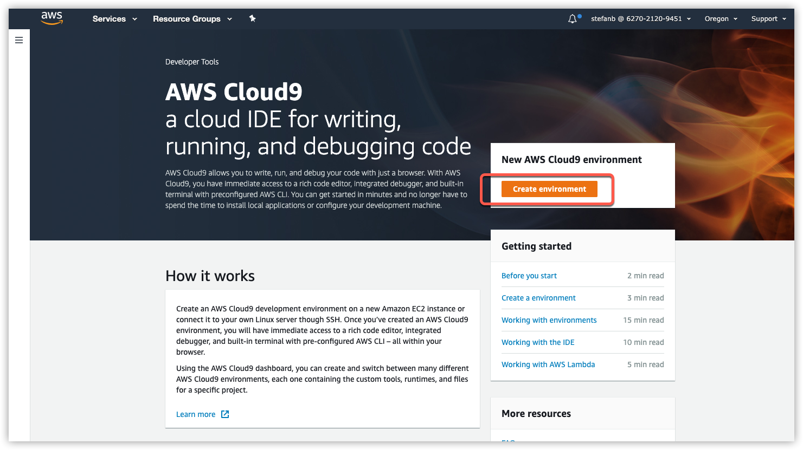
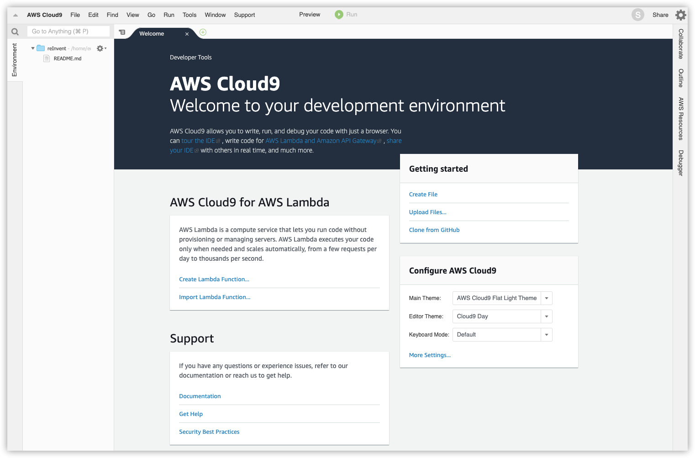

# Environment Setup <!-- omit in toc -->

We will be using React and AWS Amplify to create our frontend as well as to provision the backend resources for our project.  To ensure that we don't have any local client issues, we'll develop and deploy any code within an [AWS Cloud9](https://aws.amazon.com/cloud9/) environment.

## Table of Contents
- [Configure Cloud9](#configure-cloud9)
  - [Create Cloud9 environment](#create-cloud9-environment)
- [AWS Amplify](#aws-amplify)
  - [Install the Amplify CLI](#install-the-amplify-cli)

# Configure Cloud9

## Create Cloud9 environment

1. Click the link [here](https://us-west-2.console.aws.amazon.com/cloud9/home/product?region=us-west-2) to go to Cloud9 console. Sign in with your credentials if necessary. You need to be in **Oregon** region for this lab.

2. Click on **Create Environment**.
   

3. Give any appropriate name and description to your environment. Click on **Next**.

4. Choose **m4.large** instance type and click on **Next step**.

5. Click on **Create environment**.

6. While it is being built, you may move on to the next section.

7. After a minute or two, when your environment is up, you should see following screen.
   

# AWS Amplify

AWS Amplify makes it easy to create, configure, and implement scalable web apps powered by AWS. Amplify seamlessly provisions and manages your mobile backend and provides a simple framework to easily integrate your backend with your Web and React frontends. Amplify also automates the application release process of both your frontend and backend allowing you to deliver features faster.

## Install the Amplify CLI

First, we need to install the AWS Amplify CLI which will give us the commands needed to work with our project.

From the terminal at the bottom type the following:

```Shell
npm install -g @aws-amplify/cli
```